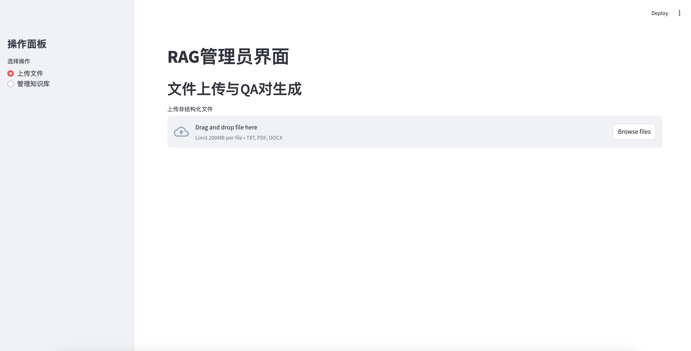

# RAG-QA-Generator
[中文版本](readme-CN.md)
## Project Overview
RAG-QA-Generator is an automated knowledge base construction and management tool designed for Retrieval-Augmented Generation (RAG) systems. It processes document data, leverages large language models to generate high-quality question-answer pairs (QA pairs), and stores this data in a database, enabling automated construction and management of RAG system knowledge bases.


## Features
- Support for multiple document formats (txt, pdf, docx)
- AI-powered generation of high-quality QA pairs
- Intuitive web interface for file upload and knowledge base management
- Flexible collection management system
- Real-time progress tracking and error handling

## Tech Stack
- Python 3.7+
- Streamlit
- OpenAI API (qwen1.5-72b model)
- unstructured library
- RESTful API

### Installation
- Clone the repository:
```
git clone https://github.com/yourusername/RAG-QA-Generator.git
cd RAG-QA-Generator
```
- Install dependencies:
```
pip install -r requirements.txt
``` 
- Configure API:
```
base_url = 'http://your-api-url/v1/'
api_key = 'your-api-key'
headers = {"Authorization": f"Bearer {api_key}"}

client = OpenAI(
    api_key="your-openai-api-key",
    base_url="http://your-openai-api-url/v1",
)
```

### Usage
- Start the application:
```
streamlit run app.py
```
- Access http://localhost:8501
- Use the interface to upload files, generate QA pairs, and manage the knowledge base.

### Contributing
Issues and pull requests are welcome. 
